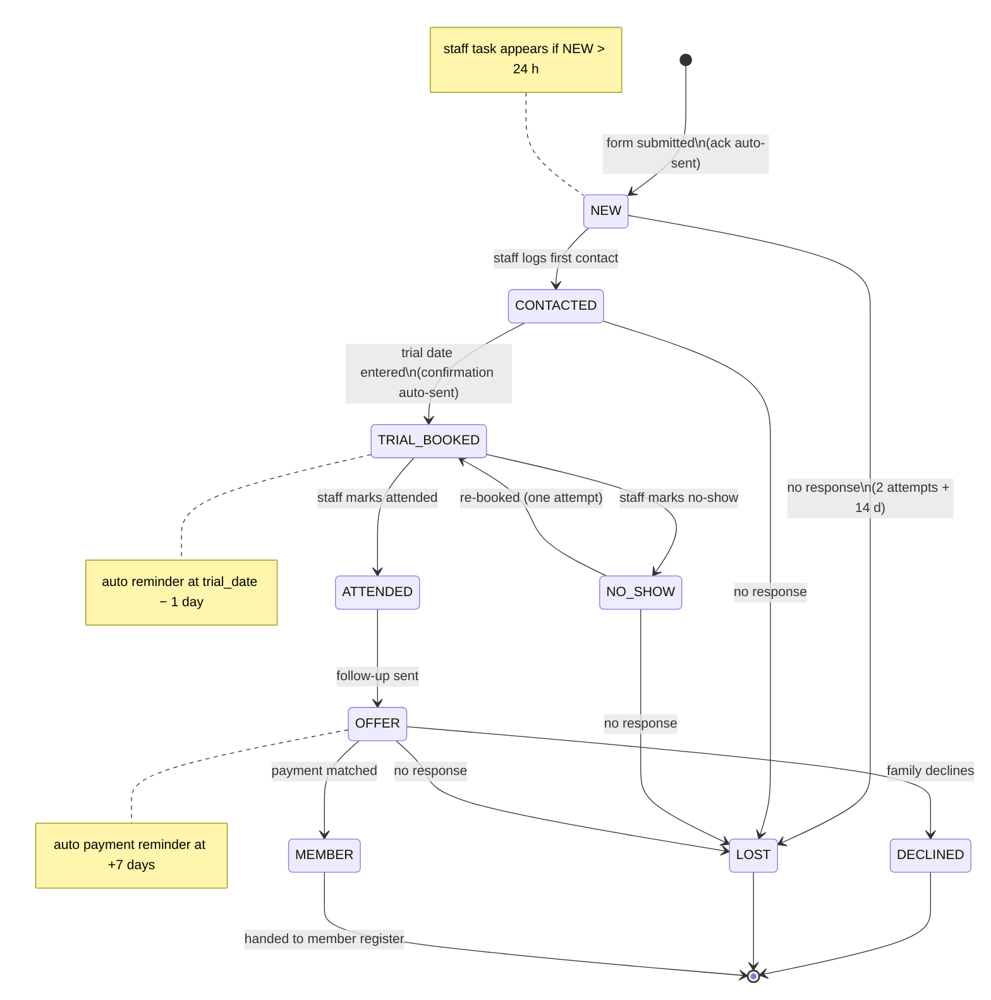

# 03 — Business Workflow: Current State and Target State Model

> Part A reconstructs today's funnel from repository evidence + labelled assumptions.
> Part B proposes the minimal applicant state model for the automation roadmap.
> **Legend:** ✅ = repository evidence · ❓ = assumption, confirm with the school (cross-referenced in doc 08).

---

## Part A — Current-state workflow

### A.1 Stage table

| # | Stage | Trigger | Actor | Tool/system | Stored data | Manual action | Failure risk | Missing automation |
|---|---|---|---|---|---|---|---|---|
| 1 | Discovery | Google Maps / search / word of mouth | Visitor | Google Business listing ❓, website ✅ | none | none | Map embed may not match listing (✅ F-10); no meta description hurts snippets (✅ F-11) | lead-source capture |
| 2 | Application submitted | Visitor sends form | Visitor | Web3Forms ✅ (`index.html:1790`) | Name, full DOB, email, phone, class, experience ✅ — stored 30 days at Web3Forms (free plan ❓), forwarded by email | none | Empty/junk submissions accepted (✅ F-03); no copy to applicant; language-dependent field values ✅ | validation, honeypot, structured record |
| 3 | Acknowledgement | — none — | — | — | — | — | **Applicant hears nothing until a human acts** ✅ (no redirect/autoresponse configured) | auto-ack email (sv/zh) |
| 4 | School notified | Web3Forms sends email | Web3Forms → instructor | Email inbox, assumed `wenxiantaekwondo@outlook.com` ❓ | email in mailbox | read the email | Email in spam/missed; single mailbox = single point of failure ❓ | delivery to shared record + notification |
| 5 | First contact | Instructor reads email | Instructor ❓ | Phone/email ❓ | none (maybe reply thread) | call/write applicant, within promised 24 h ✅ (`index.html:1758`) | forgotten application; no record that contact happened | status tracking, response-time visibility |
| 6 | Trial booked | Verbal/email agreement | Instructor + applicant | none ❓ (calendar? memory?) | none | agree a date, remember it | booked-but-not-recorded; double bookings; applicant forgets | booking record + confirmation message |
| 7 | Reminder | — none — | — | — | — | — | no-show risk highest here | T-1-day reminder |
| 8 | Trial attended / no-show | Applicant shows up (or not) | Instructor | none | none | notice attendance | attendance never recorded → no follow-up trigger | attendance mark |
| 9 | Follow-up | Instructor remembers | Instructor | phone/email ❓ | none | contact family, answer questions | most **silent-loss** point: interested families who were never asked | follow-up task + template |
| 10 | Membership decision + payment request | Family says yes | Instructor | manual instructions ❓ (method unknown: Swish? bank giro? ❓) | none | send amount + account/number + reference | wrong/missing reference; family never receives instructions | payment link/reference generation |
| 11 | Payment confirmation | Money arrives | Treasurer/instructor ❓ | bank/Swish app ❓ | bank statement only | check account, match payer name to applicant | unmatched payments (payer ≠ student name — common with parents paying for children); paid-but-not-registered | matching by reference; status flip to member |
| 12 | Member record | — | Instructor ❓ | unknown ❓ (STF/RF reporting requires *some* member register — likely IdrottOnline or a list ❓) | member list ❓ | add member manually | website applicant data never linked to member record | single record from application → member |
| 13 | Statistics / funnel report | — none — | — | — | — | — | **no funnel data exists at all** ✅ (site has zero analytics; no records) | doc 07 §metrics |

### A.2 Where applicants are lost (ranked by likely impact)

1. **Application → first contact** (stages 3–5): the applicant gets zero feedback; the school gets one email. One missed email = one silently lost family. *Repo evidence:* no ack, no redirect, promise of 24 h with no mechanism. **This is where automation pays first.**
2. **Trial attended → follow-up** (stages 8–9): nothing records attendance, so nothing prompts follow-up. Families who enjoyed the trial but are shy about chasing simply drift away.
3. **Booked → attended** (stages 6–8): no reminder → no-shows; a no-show with no re-book attempt is a lost applicant.
4. **Wants to join → payment completed** (stages 10–11): manual payment instructions + name-based matching. Parent pays for a child under a different surname; treasurer can't match; nobody chases.
5. **Duplicates & bad data** (stage 2): nothing prevents double submissions or typo'd emails/phones (no `required`, no `type` validation beyond email field ✅). Two submissions for the same child look like two applicants.

### A.3 Explicitly assumed (must confirm — see doc 08)

- Where Web3Forms delivers, who reads it, how often (D-03/D-04).
- Whether any calendar, member list, or payment routine exists outside the repo (D-06/D-09/D-12).
- Current volume: the design below assumes **5–30 applications/month** ❓; if it's 2/month, automate less; if 100/month, automate sooner.

---

## Part B — Minimal recruitment funnel and state model

### B.1 Design position: fewer states, more timestamps

The 15-state list in the review brief over-models a small club. Two rules were applied:

1. **A state answers "what should a human do next?"** If two states demand the same next action, merge them.
2. **Things that happened are timestamps, not states.** "Acknowledged", "reminder sent", "follow-up sent" are *events* — recording them as states forces artificial transitions and doubles the diagram. (This is the practical version of the *state vs. event* distinction — the single most useful modeling lesson in this project.)

Dropped/merged from the brief's list: `AUTO_ACKNOWLEDGED` (event `acked_at`), `CONTACT_NEEDED` (that's what `NEW` means), `REMINDER_SENT` (event `reminded_at`), `FOLLOW_UP_SENT` (event `followed_up_at`), `INTERESTED` (merged into `OFFER`), `PAID`+`ACTIVE_MEMBER` (merged — a paid non-active member doesn't exist here), `ARCHIVED` (a flag/GDPR action, not a funnel position).

### B.2 Recommended states (9)

| State | Meaning | Who acts next |
|---|---|---|
| `NEW` | Application received, ack auto-sent, nobody has spoken to the family | **Staff** (contact them) |
| `CONTACTED` | Spoken/written with family, trial not yet agreed | Staff (agree a date) |
| `TRIAL_BOOKED` | Trial date agreed and recorded | System (reminder), then family |
| `ATTENDED` | Came to the trial | Staff (follow up within 2 days) |
| `NO_SHOW` | Didn't come | Staff (one re-book attempt) |
| `OFFER` | Follow-up done, family deciding; payment instructions sent when they say yes → sets `payment_requested_at` | Family / then Staff (reminder + match payment) |
| `MEMBER` | Payment matched; added to member register | — (funnel complete) |
| `DECLINED` | Family said no (any point) | — (record reason, then GDPR clock starts) |
| `LOST` | No response after defined attempts (any point) | — (GDPR clock starts) |

**Event timestamps stored on the record, not modeled as states:** `created_at`, `acked_at`, `contacted_at`, `trial_date`, `reminded_at`, `attended_at`, `followed_up_at`, `payment_requested_at`, `payment_reminder_at`, `paid_at`, `closed_at`, plus `archived` flag.

### B.3 Transition table

| From → To | Trigger | Auto or staff? |
|---|---|---|
| *(none)* → `NEW` | Form submission lands in record; ack email sent immediately | **Auto** |
| `NEW` → `CONTACTED` | Staff logs first contact | Staff (assisted: task appears when `NEW` > 24 h) |
| `CONTACTED` → `TRIAL_BOOKED` | Staff enters agreed `trial_date`; confirmation sent | Staff enters; confirmation **auto** |
| `TRIAL_BOOKED` → (reminder) | `trial_date` − 1 day | **Auto** (time-based; stays in same state) |
| `TRIAL_BOOKED` → `ATTENDED` / `NO_SHOW` | Staff marks after class | Staff (assisted: prompt on `trial_date` + 1) |
| `NO_SHOW` → `TRIAL_BOOKED` | One re-book attempt succeeds | Staff |
| `NO_SHOW` → `LOST` | No response N days after re-book attempt | **Auto-suggest**, staff confirms |
| `ATTENDED` → `OFFER` | Follow-up sent (template) | Staff sends; system nags if `attended_at` + 2 days with no `followed_up_at` |
| `OFFER` → (payment reminder) | `payment_requested_at` + 7 days, unpaid | **Auto** |
| `OFFER` → `MEMBER` | Payment matched to record's reference | Staff confirms match (auto if platform/webhook later) |
| `OFFER` → `DECLINED` | Family declines | Staff |
| any active → `LOST` | No response after 2 attempts + 14 days | **Auto-suggest**, staff confirms |
| any → any | **Manual override**: staff may set any state; the record keeps an append-only note "state X→Y by <who> <when> <why>" | Staff |
| `DECLINED`/`LOST`/`MEMBER` → archived | Retention clock (doc 06 §retention): non-members purged/anonymized after the agreed period | **Auto** with review list |

**Duplicate handling:** on intake, match by (email OR phone) AND child first name. Match found + open record → *merge*: append a note "duplicate submission <date>", don't create a second row. Match found + closed record → new record linked to old (returning applicant is a real, welcome case). Never silently discard — a duplicate often means "we never answered the first one."

**Failures and retries:** every automated send records success/failure on the record (`ack_status`). Failed sends surface on the staff view's "needs attention" list — *visible failure beats silent retry* at this scale. Retry manually with one click; add automatic retry only if failures turn out to be common.

### B.4 State diagram

### B.5 Minimum data per record

Application fields (name, birth **year** — see doc 06 for why not full DOB, guardian name, email, phone, class, experience, preferred language, optional "how did you find us"), plus: `state`, the event timestamps from B.2, `payment_reference`, free-text staff notes (append-only), consent record (`consent_text_version`, `consented_at`).

> **Learning note — why a state model before any tool choice:** the table above is tool-agnostic. It can be implemented as a Google Sheet with a `state` column, a Trello board, a club platform, or a database. Choosing the model first means the tool comparison in doc 04 can be scored against *concrete required transitions* instead of feature marketing. Beginners usually do this backwards (pick tool, discover workflow doesn't fit).
