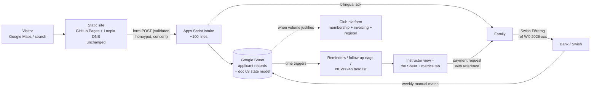

# 05 — Recommended Architecture

> Three sections: **A** — frontend refactoring level (Part 8 of the brief), **B** — payment architecture for Sweden (Part 6), **C** — end-to-end target architecture.

---

## A. Frontend refactoring assessment

### A.1 The four levels, judged

| Level | What | Verdict |
|---|---|---|
| **0 — keep the file** | Only bugs/security/a11y fixes | Right for *this week*, wrong as an end state: F-02 duplication keeps drifting and the 237 KB file keeps taxing every edit |
| **1 — conservative static split** | Same site, files by concern, no build step | **Recommended.** Solves every *actual* problem found (doc 02) at near-zero risk |
| **2 — static site generator** | Eleventy/Astro etc., components + build | Solves problems this site doesn't have (many pages, shared layouts). One page, two languages via runtime dictionary — a build step adds a toolchain for zero content leverage. **Not now**; revisit only if the site grows to 5+ real pages |
| **3 — framework app** | React/Vue/Next | No product requirement points here: no client-side state beyond a language flag and a modal. Would *hurt*: build pipeline, dependency churn on a volunteer project, slower page. **Rejected** |

**The test used (learn this):** a refactor level is justified only by a *named, recurring cost* it removes. Level 1 removes: two-source i18n drift, 1,300-line scroll-past-CSS edits, unreviewable diffs, second-contributor lockout. Levels 2–3 remove costs this repo does not pay.

### A.2 Proposed file tree (Level 1)

```text
/
├── index.html            # structure + content ONLY (~750 lines)
├── tack.html             # bilingual thank-you page (form redirect target; Phase 2 hooks here)
├── integritet.html       # privacy notice (doc 06) — sv/zh
├── css/
│   ├── base.css          # :root tokens, reset, typography, section primitives
│   ├── layout.css        # nav, hero, footer, grids, MOBILE media queries
│   └── components.css    # cards, table, form, pricing, modal, media cards
├── js/
│   ├── i18n.js           # applyLang/toggleLang + localStorage (mechanism only)
│   ├── translations.js   # the T dictionary (data only — today's lines 2061–2214)
│   ├── media.js          # mediaItems + modal logic (today's 2279–2381)
│   └── effects.js        # IntersectionObserver + smooth scroll (today's 2244–2262)
├── assets/
│   ├── img/              # hero.jpg (un-base64'd), gallery *web-sized*, instructor
│   └── img/full/         # optional: full-resolution originals for the modal
├── docs/                 # this review + future runbook
└── CNAME                 # unchanged
```

**One responsibility per file:** `translations.js` = *what the site says in zh* (content edits happen here or in HTML, never both — see A.4); `i18n.js` = *how switching works*; `media.js` = *gallery/modal behavior*; `effects.js` = decoration (deletable without functional loss — that's how you know it's correctly isolated); `base/layout/components.css` split by *how often they change* (tokens rarely, layout occasionally, components most).

**Dependencies between modules:** `i18n.js` reads `translations.js` (load order: translations first — the only ordering constraint, so keep both `<script>` tags adjacent); `media.js` and `effects.js` are independent of everything. No module writes another's state. That near-zero coupling is why this split is safe.

**Testability/extension gains:** `translations.js` as pure data enables the key-parity check (doc 02 §testability) and gives translators/a second volunteer a file they can edit without touching markup; a third language becomes "add `T.en`, generalize the toggle"; gallery additions become one array entry once cards are generated from `mediaItems` (optional step F below).

**Deliberately kept simple:** no build step, no minification, no CSS methodology (BEM etc.), no JS modules/imports (plain `<script>` tags in order), no framework, no bundler. Every one of these would add a tool between "edit" and "see it live" — the current 10-second edit-push-refresh loop is a *feature* for a volunteer project.

### A.3 Migration risks & how design/URLs/deployment are preserved

- **Risks:** (1) CSS extraction typos — mitigate by copying byte-for-byte, then verifying with a scripted diff of computed styles or simple visual pass at 3 widths (375/768/1280); (2) the ~60 inline `style=` attributes stay inline in this pass (moving them is a separate, optional cleanup — don't mix steps); (3) script order (translations before i18n); (4) cache — GitHub Pages serves with short max-age, hard-refresh when verifying; (5) the base64 hero → file swap changes paint timing slightly (imperceptible; verify hero renders on slow 3G throttle).
- **URLs:** the site is one URL + hash anchors; splitting files changes nothing public. `tack.html`/`integritet.html` are *new* URLs — no existing link breaks.
- **Domain/deployment:** untouched — same repo, same branch, same Pages config, `CNAME` stays. A split is invisible to Loopia/DNS.
- **Rollback:** every step below is one `git revert` away; Phase 0 tags the pre-refactor commit.

### A.4 Step-by-step (mentor format, per the working agreement)

**Step 1 — extract CSS**
- **Observation:** 1,333 lines of CSS (8–1340) sit above the content, including a 140 KB base64 image (line 132).
- **Why it matters:** every content edit scrolls past it; every CSS typo risks the whole page; the image bloats the HTML parse.
- **Learning concept:** *physical separation of concerns* — files as units of change (doc 02).
- **Smallest safe change:** cut lines 9–1339 into the three CSS files **unmodified** (split at the existing section comments: base = tokens→SECTIONS; layout = NAV/HERO/FOOTER/MOBILE; components = the rest); replace `<style>…</style>` with three `<link>` tags. Save the base64 blob as `assets/img/hero.jpg` (decode it: `grep -o 'base64,[^"]*' | base64 -d > hero.jpg`) and change line 132's `url(...)` to `url(../assets/img/hero.jpg)`.
- **Files affected:** `index.html`, `css/*`, `assets/img/hero.jpg`.
- **Verify manually:** open locally (`python3 -m http.server`), compare against production side-by-side at 375/768/1280 px; check hero image, fonts, modal styling; then push and re-check on the real domain.
- **Commit:** `refactor: extract CSS to css/ and un-embed hero image (no visual change)`.
- **What you learn:** that a mechanical, no-logic-change refactor with a clear verification plan is boring — and that boring is the goal.
- **Not yet:** don't rename classes, don't touch inline styles, don't optimize images in the same commit.

**Step 2 — extract JS** (same pattern): move the three script blocks to `js/translations.js` + `js/i18n.js`, `js/effects.js`, `js/media.js`; four `<script src>` tags at the same position in the body. Verify language toggle (persists after reload — localStorage), modal (open/close/arrows/Escape/back-button), fade-ins. Commit separately.

**Step 3 — kill the i18n dual source (the one *logic* change):** decide the authority. **Recommendation: HTML is the Swedish source; delete `T.sv`.** Rationale: Swedish is the no-JS default and the primary audience; keeping it in markup preserves progressive enhancement and semantic HTML, and `applyLang('sv')` then means "restore defaults" — implement by caching each element's original text on first run (`el.dataset.default ??= el.textContent`) and restoring from that. `translations.js` shrinks to `T.zh` only. Fix the line-1937 drift as part of this. Verify by toggling sv→zh→sv and diffing against production text. *This step converts F-02 from "recurring risk" to "solved".*

**Step 4 — media hygiene:** delete the four unreferenced `.mp4`s (originals live on YouTube; keep local copies outside the repo); re-encode gallery images to ~1600 px/85 % quality (~150–400 KB each) in `assets/img/`, keep originals in `assets/img/full/` **only** if the modal should show high-res (decide — or point the modal at the same web-sized file, which at 1600 px is fine); replace `huvudtränare.jpeg` with `assets/img/instructor.jpg` at ~800 px. Optional afterwards: rewrite git history to drop old blobs (`git filter-repo` or BFG) — **coordinate first**, history rewrite on a live repo needs a deliberate moment (doc 07 Phase 1 marks it optional).
- Expected outcome: full-page transfer drops from ~60 MB to ~3–4 MB. This step is the single biggest user-facing win in the whole roadmap.

**Step 5 — form integrity (independent of the split; can even go first):** add `required` to name/email/phone/class; add `value="mini|junior|youth"` to the class options and `value="none|some|experienced"` to experience (fixes language-dependent data, F-03); add the Web3Forms honeypot (`<input type="checkbox" name="botcheck" class="hidden" style="display:none">`) and enable hCaptcha per their docs; add hidden `redirect` to `https://wenxiantaekwondo.se/tack.html`; create `tack.html`; **remove "via Recess.tv"** (line 1788) and the stale CSS comment (656); add the consent checkbox + link to `integritet.html` (text in doc 06). Verify with one real submission end-to-end (received? redirect works? values are the machine-readable ones?).

**Step 6 (optional, later) — generate gallery cards from `mediaItems`:** delete the 16 HTML cards, render them in `media.js`; or keep HTML cards as real `<a>` links (progressive enhancement, doc 02) and drop the array. Either way: **one list**. Do this only when next touching the gallery — no urgency.

---

## B. Payment architecture for Sweden

Constraints: ideell förening; payers are Gothenburg families; ~1,700 kr/termin (`index.html:1875–1877`); volume maybe 20–60 payments per termin ❓; **never store card data ourselves** (nothing in this architecture ever touches card numbers — that stays inside Swish/Stripe/bank).

| Approach | What it requires | Automation potential | Fees (verify with provider/bank) | Fit |
|---|---|---|---|---|
| **Swish Företag** (123-number) | Business/förening agreement via the club's bank | Payment message can carry a reference code → semi-manual matching; **no API/webhook** on this product | ~2 kr/transaction + small monthly fee, bank-dependent | **Best now** — every Swedish parent has Swish; near-zero setup |
| **Swish Handel** | Merchant agreement + API certificates (or a technical supplier) | Full API: initiate payment, **callbacks** on completion → true auto-matching | ~3 kr/transaction + ~299 kr/mo, bank-dependent | Overkill at this volume unless wrapped inside a platform |
| **Stripe Payment Links** | Stripe account for the förening (org.nr) | Link per applicant/term; **webhooks free**; auto receipts; dashboard | ~1.5 % + ~2 kr per EEA card tx (verify stripe.com/en-se/pricing) → ~27 kr on 1,700 kr | Good middle path *if* card payment is wanted; fees ~10× Swish's |
| **Club platform invoicing** (SportAdmin/MyClub/Svenskalag/Zoezi) | Platform subscription (doc 04 B) | Invoice/payment-link per member, **auto-matched, auto-reminded**, feeds member register + bookkeeping export | Platform fee + per-payment fees vary (verify) | **Best end state** — matching problem disappears |
| **Bank transfer/bankgiro with OCR** | Existing bank account | OCR reference matching is what platforms/bookkeeping tools automate; manual otherwise | ~0/tx | Fine as fallback; worst UX for parents |
| **Recurring (autogiro/subscriptions)** | Heavier agreements | — | — | **Not relevant**: fee is per termin; skip |

**Recommended sequence:**
1. **Now (Phase 4 bridge):** Swish Företag. The Sheet generates a per-applicant reference (e.g. `WX-2026-014`) included in the payment-request email ("betala 1 700 kr till 123 XXX XX XX, meddelande: WX-2026-014"). Treasurer checks the Swish app/bank export weekly and marks `paid_at` in the Sheet — matching is one glance because the reference is on the record. *What stays outside the website:* everything — the site never sees payment data.
2. **End state:** platform invoicing (doc 04 recommendation), which also answers refunds (per its terms), failed-payment reminders, and produces bookkeeping-ready exports.
3. **Refunds/failures:** with Swish, refunds are manual Swish-back (record on the applicant row); define one policy line in the decision log (D-10). **Bookkeeping:** membership-fee accounting and the "inkl. moms" question (doc 01 F-13) must be confirmed with the association's treasurer — outside this review's authority.
4. **Webhook verification** (only if Stripe/Handel ever used): validate signatures server-side (Stripe signing secret / Swish certificates) — never trust a "paid" signal arriving client-side. Until then, this concern doesn't exist — by design there is no endpoint to attack.

## C. End-to-end target architecture



**Why each layer exists:** the static site exists because content is static (cheapest correct tool); the intake script exists to turn an email into a *record* (the one thing today's system lacks); the Sheet exists because the staff view, the state model, and the metrics need a shared home a non-technical instructor already knows how to use; the platform exists (later) because payment matching and member registers are commodity, regulated club infrastructure that shouldn't be volunteer code. **Every abstraction pays for itself or is absent** — no admin app, no database, no auth system, because the Sheet's sharing model covers access control at this scale (doc 06 hardens it).

**When does GitHub Pages stop being sufficient?** Practically never for the *public site*. Pages only fails you if you need: server-side rendering, secrets on the server, or receiving webhooks. In this architecture those live in Apps Script/the platform — not on Pages. Re-host only if the school someday wants logged-in member pages (that's the platform's job anyway).
